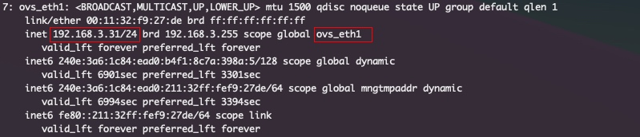
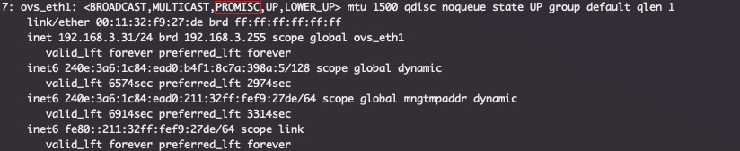

docker 安装 ImmortalWrt，并分配局域网 IP

<!--more-->

### 1. 终端中查看网络信息
```
ip addr
```
找到群晖ip地址所在的那行, scope global 后面就是网卡信息



### 2. 开启网卡混杂模式
```
ifconfig ovs_eth1 promisc
```
再次查看网络信息，网卡上出现 PROMISC 说明开启成功



关闭网卡混杂模式
```
ifconfig ovs_eth1 -promisc
```

### 3. docker 创建 macvlan 网络
> 参考：https://docs.docker.com/network/drivers/macvlan/

```
docker network create -d macvlan \
  --subnet=192.168.3.0/24 \
  --gateway=192.168.3.1 \
  --ipv6 \
  --subnet=fd1e:6551:6c39::/64 \
  --gateway=fd1e:6551:6c39::1 \
  -o parent=ovs_eth1 \
  macnet
```

查看创建的网络
```
docker network ls
```


gunzip immortalwrt-23.05.1-x86-64-generic-rootfs.tar.gz

docker import immortalwrt-23.05.1-x86-64-generic-rootfs.tar immortalwrt:23.05.1

```
docker run -d \
   --restart always \
   --name openwrt \
   --privileged \
   --network macnet \
   --ip 192.168.3.100 \
   immortalwrt:23.05.1 \
   /sbin/init
```

```
config interface 'loopback'
    option proto 'static'
    option ipaddr '127.0.0.1'
    option netmask '255.0.0.0'
    option device 'lo'

config interface 'wan'
    option proto 'dhcp'
    option device 'eth0'

config interface 'wan6'
    option proto 'dhcp6'
    option device 'eth0'
```


> 参考：
> https://blog.simpdog.me/posts/using-docker-to-deploy-openwrt-as-a-home-router/